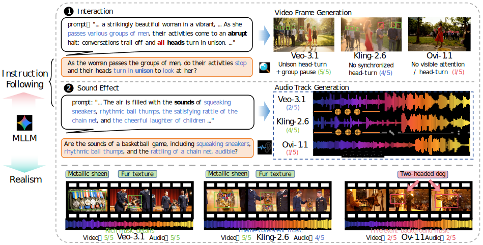
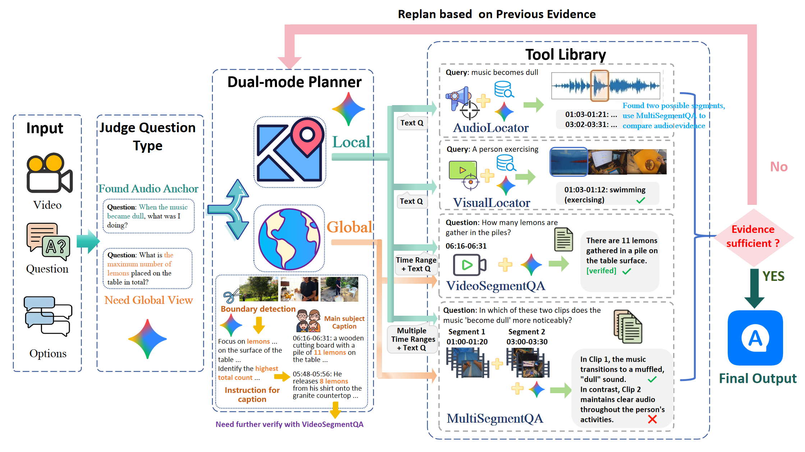
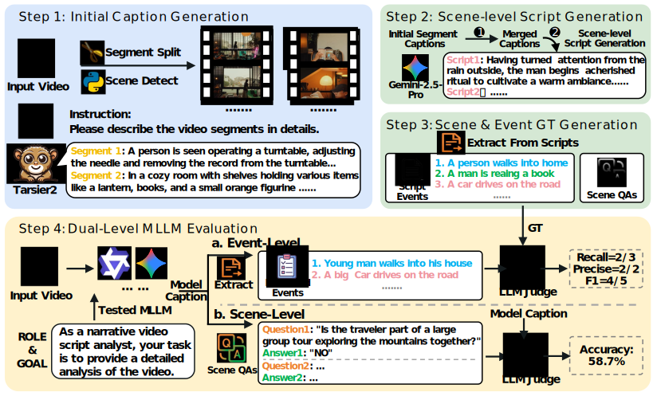








# 👋 About me

**Hello! I’m Wangjiahao (王佳豪) 👋**

I’m currently a junior majoring in Software Engineering at Nanjing University (NJU).

Previously, I was an intern at [NJU-LINK Lab](https://www.nju-link.com/zh/) led by [Prof. Jiaheng Liu](https://liujiaheng.github.io/).

**Research interests:** post-training and evaluation for multimodal large language models.

# 📖 Educations
- *2023.09 - now*, &nbsp;Software Engineering at [Nanjing University](https://www.nju.edu.cn/)

# 📝 Publications

<table>
  <tr>
    <td width="35%">
      <!-- 建议：在这里放置论文的 Pipeline 图或效果对比图 -->
      <!-- 如果你还没有图，可以先用下面这张占位图，后续替换为自己仓库里的图片链接 -->
      
    </td>
    <td width="65%">
      <b>OmniCap-IF: Benchmarking and Improving Instruction Following Abilities for Omni-Video Captioning</b> 
      <!-- 使用 * 来标注共一，并使用 et al. 缩略 -->
      <b>Jiahao Wang</b>*, An Ping*, Yanghai Wang*, Yuanxing Zhang, Shihao Li, et al. 
      <i>ACM MM, 2026, Under Review</i>  
      
      

        The dataset and model will be open-sourced as soon as possible.
      

    </td>
  </tr>
</table>

<table>
  <tr>
    <td width="35%">
      <!-- 建议：在这里放置论文的 Pipeline 图或效果对比图 -->
      <!-- 如果你还没有图，可以先用下面这张占位图，后续替换为自己仓库里的图片链接 -->
      
    </td>
    <td width="65%">
      <b>T2AV-Compass: Towards Unified Evaluation for Text-to-Audio-Video Generation</b> 
      <!-- 使用 * 来标注共一，并使用 et al. 缩略 -->
      Zhe Cao*, Tao Wang*, Jiaming Wang*, Yanghai Wang*, Yuanxing Zhang, <b>Jiahao Wang</b> et al. 
      <i>ICML, 2026, Under Review</i>  
      <!-- 按钮链接区域 -->
      
      
      
      
    </td>
  </tr>
</table>

<table>
  <tr>
    <td width="35%">
      <!-- 建议：在这里放置论文的 Pipeline 图或效果对比图 -->
      <!-- 如果你还没有图，可以先用下面这张占位图，后续替换为自己仓库里的图片链接 -->
      
    </td>
    <td width="65%">
      <b>AdaptiveOmniAgent: Dynamic Routing for Audio-Visual Understanding</b> 
      <!-- 使用 * 来标注共一，并使用 et al. 缩略 -->
      Jiafu Tang*, Haowen Chen*, Yanghai Wang, Yue Ding, <b>Jiahao Wang</b>, et al. 
      <i>ECCV, 2026, Under Review</i>  
      

        The paper will be open-sourced as soon as possible.
      

    </td>
  </tr>
</table>

<table>
  <tr>
    <td width="35%">
      <!-- 建议：在这里放置论文的 Pipeline 图或效果对比图 -->
      <!-- 如果你还没有图，可以先用下面这张占位图，后续替换为自己仓库里的图片链接 -->
      
    </td>
    <td width="65%">
      <b>LVSG-Bench: Towards Benchmarking Long-form Video Script Generation Capabilities of Multimodal LLMs</b> 
      <!-- 使用 * 来标注共一，并使用 et al. 缩略 -->
      Yanghai Wang*, Zhe Cao*, Yuanxing Zhang, Yifan Yao, <b>Jiahao Wang</b> et al. 
      <i>ECCV, 2026, Under Review</i>  
      

        The paper will be open-sourced as soon as possible.
      

    </td>
  </tr>
</table>

  <small>* Equal Contribution</small>

